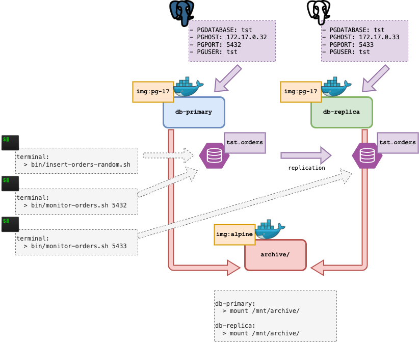

# Postgres Replica Test

A small docker based lab to test Postgres v17 replication.

## Proposal

- to build a new Pg container from the latest available packages from Alpine Linux.
- start a `db-primary` container and a `db-replica` container.
- distribute `wal` archive files via an internal mount point.
- execute a script that generates random batches of `INSERT` rows.
- use a terminal window to monitor the insertions at `db-primary`.
- use another terminal window to monitor the insertions at `db-replica`.

## Diagram

Initial diagram:

