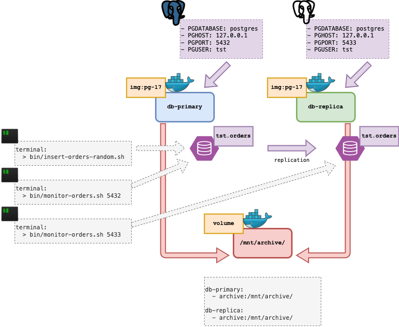
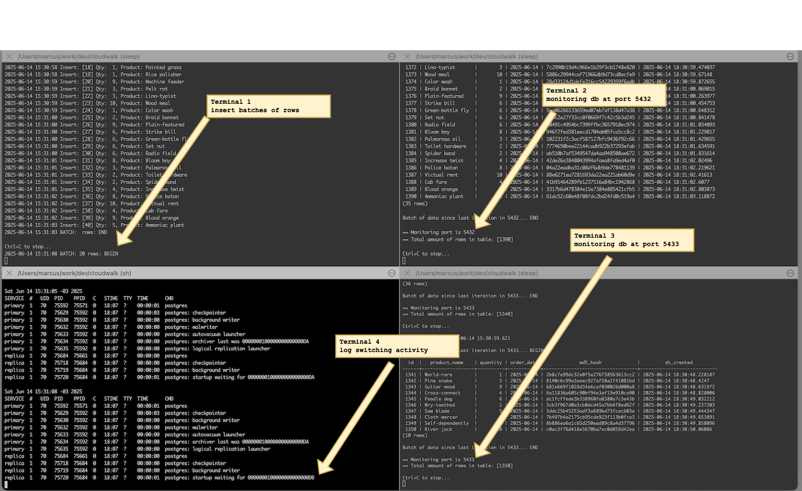
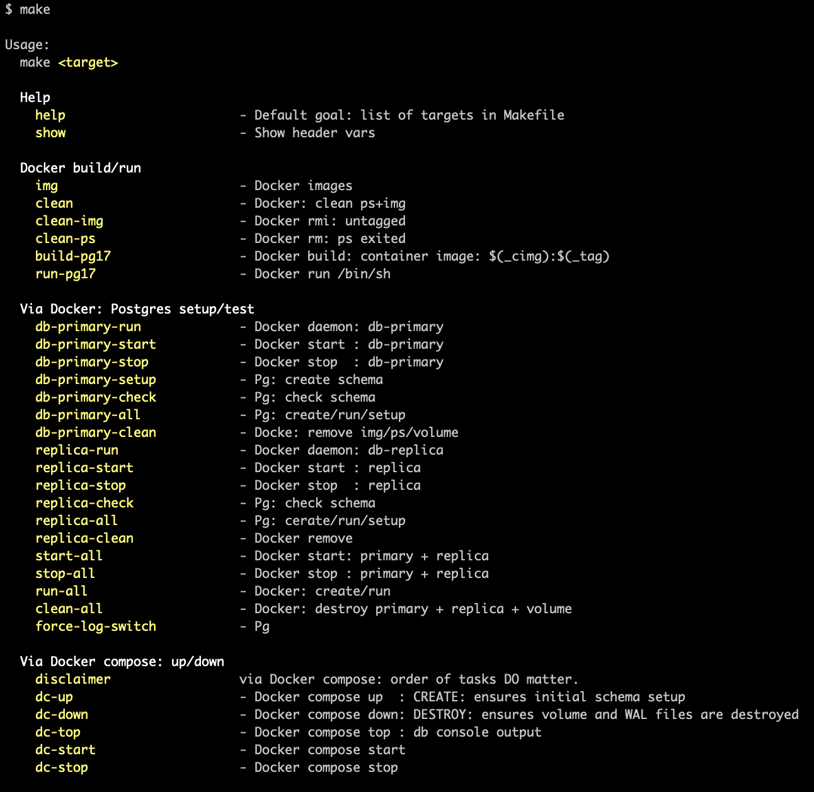

# Postgres Replica Test

A small docker based lab to test Postgres v17 replication.


## Proposal

- to build a new Pg container from the latest available packages from Alpine Linux.
- start a `db-primary` container and a `db-replica` container.
- share `wal` archive files via an internal mount point.
- implement replication via Log Shipping.
- execute a script that generates random batches of `INSERT` rows.
- use a terminal window to monitor the insertions at `db-primary`.
- use another terminal window to monitor the insertions at `db-replica`.


## Diagram

Initial diagram:




## Implementation

To test the implementation follow the instructions:

 1. Initial setup
 2. Begin insertions in `primary`
 3. Monitor insertions in `primary`
 4. Monitor insertions in `replica`
 5. Check database activiy on log switching
 6. Tear down


As suggestion, using a window with at least 4 terminals available will produce the following result that will allow the visualizations of all moving parts.



What is expected to be seen:


### 1. Initial setup

Build container image using Postgres v17 and start 2 containers:

```
## Terminal 1: Build and start `pg` container
source .envrc     # export et al
make build-pg17   # docker build
make dc-up        # start,setup,run -- via docker compose
```

Expected result:


```
$ docker ps -a
CONTAINER ID   IMAGE     COMMAND                  CREATED        STATUS        PORTS                    NAMES
39d755e59748   pg-17     "/usr/bin/gosu postg…"   A minute ago   Up a minute   0.0.0.0:5433->5432/tcp   pg-replica-1
21795d3437f6   pg-17     "/usr/bin/gosu postg…"   A minute ago   Up a minute   0.0.0.0:5432->5432/tcp   pg-primary-1

```

Full output [here](docs/output.01.png).

### 2. Begin insertions in `primary`

Insert script creates random batches of rows (in groups of 10) and populates `tst.orders`.

Let the script running ad infinitum...

```
## Terminal 1:
bin/insert-random-orders.sh
```

Output:
```
$ bin/insert-random-orders.sh
2025-06-14 15:16:17 BATCH: 10 rows: BEGIN
2025-06-14 15:16:18 Insert: [01] Qty:  3, Product: Sundra tree
2025-06-14 15:16:18 Insert: [02] Qty:  9, Product: Pro-manchukuoan
2025-06-14 15:16:18 Insert: [03] Qty:  3, Product: Chorea minor
2025-06-14 15:16:18 Insert: [04] Qty:  6, Product: Quasi charity
2025-06-14 15:16:18 Insert: [05] Qty:  5, Product: By-wash
2025-06-14 15:16:19 Insert: [06] Qty:  5, Product: Agate jasper
2025-06-14 15:16:19 Insert: [07] Qty:  4, Product: Sad-natured
2025-06-14 15:16:19 Insert: [08] Qty:  8, Product: Sword dollar
2025-06-14 15:16:19 Insert: [09] Qty:  1, Product: Quasi deficit
2025-06-14 15:16:19 Insert: [10] Qty:  4, Product: Prince-proud
2025-06-14 15:16:21 BATCH:  rows: END

Ctrl+C to stop...
```

### 3. Monitor insertions in `primary`

In another terminal -- for example, terminal 2 -- follow in real time how the table is being populated.

Watch for different batches of inserts will increase the total amount of rows in the table.

```
## Terminal 2: monitor `primary` db.
source .envrc                 # export et al
bin/monitor-orders.sh 5432    # db-primary port
```

Output:
```
== Status date: 2025-06-14 15:21:57.404

Batch of data since last iteration in 5432... BEGIN

 id |   product_name   | quantity | order_date |             md5_hash             |         dt_created
----+------------------+----------+------------+----------------------------------+----------------------------
 61 | Pro-gentile      |        5 | 2025-06-14 | 4eac869f71036b07cfc98ee7534c68ff | 2025-06-14 18:21:54.165071
 62 | Hip lock         |        8 | 2025-06-14 | a9e57a7d599d447d9bd9a62fc5e0766e | 2025-06-14 18:21:54.361467
 63 | Goose plant      |       10 | 2025-06-14 | 5916844f96968b2dd3df267ae61847a4 | 2025-06-14 18:21:54.555732
 64 | Line-sequential  |        2 | 2025-06-14 | 2a1ff217dbc752e668d24cf0679ec188 | 2025-06-14 18:21:54.747838
 65 | Frog-belly       |        2 | 2025-06-14 | 4e51f5532388ef15d2983679b53719ec | 2025-06-14 18:21:54.941904
 66 | Bulldog edition  |        7 | 2025-06-14 | 51e162d1231f8970fa626588887a24c2 | 2025-06-14 18:21:55.139493
 67 | Booking office   |        2 | 2025-06-14 | ff7e0f6573845604188c5a895020ee29 | 2025-06-14 18:21:55.335125
 68 | Brush rabbit     |        1 | 2025-06-14 | 9069d7a4d89c1d72139052f101018a3b | 2025-06-14 18:21:55.542393
 69 | Steel-bright     |        7 | 2025-06-14 | 61b0e00f32b51630ab3569b4eb1a6bb6 | 2025-06-14 18:21:55.735954
 70 | Floor chisel     |        9 | 2025-06-14 | ab5db724ac5ebaaa304d1331977b2eff | 2025-06-14 18:21:55.927886
(10 rows)

Batch of data since last iteration in 5432... END

== Monitoring port is 5432
== Total amount of rows in table: [70]

Ctrl+C to stop...
```

### 4. Monitor insertions in `replica`

In another new terminal -- for example, terminal 3 -- follow again in real time how the inserted batches of rows are being replicated.

```
## Terminal 3: monitor `replica` db.
source .envrc                 # export et al
bin/monitor-orders.sh 5433    # db-replica port
```

Output:
```
== Status date: 2025-06-14 15:26:16.228

Batch of data since last iteration in 5433... BEGIN

 id  |   product_name   | quantity | order_date |             md5_hash             |         dt_created
-----+------------------+----------+------------+----------------------------------+----------------------------
 661 | Bog bean         |        1 | 2025-06-14 | 56658885cd457d5ff316241fc1823ee6 | 2025-06-14 18:26:06.247738
 662 | Robber bee       |        7 | 2025-06-14 | b3cbd571307d6881dce3e47b9cf3bfbe | 2025-06-14 18:26:06.442956
 663 | River ash        |        7 | 2025-06-14 | 021bb5d4e3515d5a7ae712a23be84ea5 | 2025-06-14 18:26:06.635024
 664 | Skew curve       |        7 | 2025-06-14 | 9c67ec083c407c70c3fc5ef46c49f0f2 | 2025-06-14 18:26:06.828684
 665 | Ground snake     |        5 | 2025-06-14 | e1f5d872e0874f88b81fc61f5e82609e | 2025-06-14 18:26:07.020539
 666 | Exhaust fan      |        2 | 2025-06-14 | a5a5d7ca90956805dddda616657f9eab | 2025-06-14 18:26:07.217427
 667 | Ill-persuaded    |        1 | 2025-06-14 | a31fb6b08015bf10bbb9f055feec1e59 | 2025-06-14 18:26:07.407446
 668 | Geranium creeper |       10 | 2025-06-14 | f0b868a7def333fa25b450ceb20d13c7 | 2025-06-14 18:26:07.598423
 669 | Fine-bore        |        5 | 2025-06-14 | ada7681575c24fd583499b4528d6c98d | 2025-06-14 18:26:07.797486
 670 | World-chosen     |        3 | 2025-06-14 | b1e5338ed495a5c054095ebd900c9fde | 2025-06-14 18:26:08.002313
(10 rows)

Batch of data since last iteration in 5433... END

== Monitoring port is 5433
== Total amount of rows in table: [670]

Ctrl+C to stop...
```

### 5. Check database activiy on log switching

Yet in another extra terminal  -- for example, terminal 4 -- is possible to verify database activity and the rate of log switching.

```
# Terminal 4: verify database daemon output
source .envrc   # just in case
make dc-top     # docker compose top
```

Output:
```
Sat Jun 14 15:29:21 -03 2025
SERVICE  #   UID  PID    PPID   C   STIME  TTY  TIME      CMD
primary  1   70   75592  75571  0   18:07  ?    00:00:01  postgres
primary  1   70   75629  75592  0   18:07  ?    00:00:02  postgres: checkpointer
primary  1   70   75630  75592  0   18:07  ?    00:00:00  postgres: background writer
primary  1   70   75632  75592  0   18:07  ?    00:00:00  postgres: walwriter
primary  1   70   75633  75592  0   18:07  ?    00:00:00  postgres: autovacuum launcher
primary  1   70   75634  75592  0   18:07  ?    00:00:00  postgres: archiver last was 0000000100000000000000B5
primary  1   70   75635  75592  0   18:07  ?    00:00:00  postgres: logical replication launcher
replica  1   70   75684  75661  0   18:07  ?    00:00:00  postgres
replica  1   70   75718  75684  0   18:07  ?    00:00:00  postgres: checkpointer
replica  1   70   75719  75684  0   18:07  ?    00:00:00  postgres: background writer
replica  1   70   75720  75684  0   18:07  ?    00:00:01  postgres: startup waiting for 0000000100000000000000B4
```

 ### 6. Tear down

 To tear down all resources created:

 ```
 # In any terminal:
 make dc-down
 ```

 Output:
 ```
 docker compose down -v
[+] Running 4/4
 ✔ Container pg-replica-1  Removed     0.5s
 ✔ Container pg-primary-1  Removed     0.4s
 ✔ Volume pg_wal-archive   Removed     0.0s
 ✔ Network pg_db           Removed     0.3s

== Down: all resources destroyed.
```


# FAQ

### 1. Why Docker and not Vagrant/Virtubalbox?

* Because of the challenge of provisioning via `Dockerfile` instead of using a `Vagrantfile`.
* Because of how easier is to share the solution via a container image versus a vbox file.
* Because of how easy is to create a volume shared between `'n'` containers.


### 2. Why using Postgres Log Shipping and not Streaming?

WAL Log Shipping proved to be very simple to setup with minimal configuration.

Streaming configuration can be done in a future next step.

At configuration level `postgresql.conf` of each server must have:

```
# Server: db-primary
listen_addresses = '*'
wal_level = replica
archive_mode = on
archive_command = 'test ! -f /mnt/archive/%f  &&  /bin/cp %p /mnt/archive/%f'

# Test in Docker
checkpoint_timeout = 30s # range 30s-1d
archive_timeout = 2      # force a WAL file switch after this number of seconds; 0 disables
```
```
# Server: db-replicia
listen_addresses = '*'
wal_level = replica
archive_mode = on
hot_standby = on
restore_command = 'cp /mnt/archive/%f %p'
archive_cleanup_command = 'pg_archivecleanup /mnt/archive %r'

# Test in Docker
archive_timeout = 30
```

At runtime level, using log shipping adds to a nice effect of realizing the steps taken by `checkpoint > archive > ship > restore`.

The observed delay between servers is not a bug, but a feature that demonstrates how the replication mechanism is keeping the flow of data up-to-date.


### 3. Why use a `Makefile`?

Because it is a very useful helper to organize simple tasks or some specific workflows of tasks.

For a development scenario of fast trial-and-error it is a tool I still keep using.

To see all the current tasks inside `Makefile`:

```
make    # no targets
```




