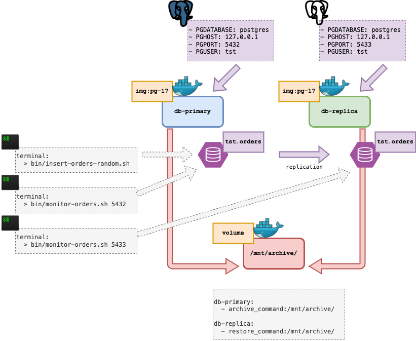

# Postgres Replica Test

A small docker based lab to test Postgres v17 replication.


## Proposal

- to build a new Pg container from the latest available packages from Alpine Linux.
- start a `db-primary` container and a `db-replica` container.
- share `wal` archive files via an internal mount point.
- implement replication via Log Shipping.
- execute a script that generates random batches of `INSERT` rows.
- use a terminal window to monitor the insertions at `db-primary`.
- use another terminal window to monitor the insertions at `db-replica`.


## Diagram

Initial diagram:




## FAQ

### 1. Why Docker and not Vagrant/Virtubalbox?

* Because of the challenge of provisioning via `Dockerfile` instead of using a `Vagrantfile`.
* Because of less RAM/Disk resources that Docker uses less when compared to Virtualbox.
* Because of how easier to is to share the solution via a container image versus a vbox file.
* Because of how easy is to create a volume shared between `'n'` containers.


### 2. Why using Postgres Log Shipping and not Streaming?

WAL Log Shipping proved to be very simple to setup with minimal configuration, and no need of any network setup.

At configuration level `postgresql.conf` of each server must have:

```
# Server: db-primary
listen_addresses = '*'
wal_level = replica
archive_mode = on
archive_command = 'test ! -f /mnt/archive/%f  &&  /bin/cp %p /mnt/archive/%f'

# Test in Docker
checkpoint_timeout = 30s # range 30s-1d
archive_timeout = 2      # force a WAL file switch after this number of seconds; 0 disables
```
```
# Server: db-replicia
listen_addresses = '*'
wal_level = replica
archive_mode = on
hot_standby = on
restore_command = 'cp /mnt/archive/%f %p'
archive_cleanup_command = 'pg_archivecleanup /mnt/archive %r'

# Test in Docker
archive_timeout = 30
```

At runtime level, using log shipping adds to a nice effect of realizing the steps taken by `checkpoint > archive > ship > restore`.

The observed delay between servers is not a bug, but a feature that demonstrates how the replication mechanism is keeping the flow of data up-to-date.


